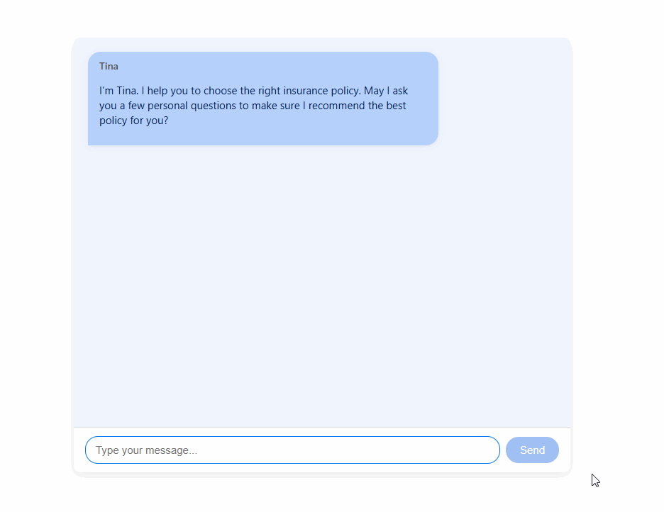

<!-- Improved compatibility of back to top link: See: https://github.com/othneildrew/Best-README-Template/pull/73 -->

<a id="readme-top"></a>

<!-- PROJECT SHIELDS -->

[![Contributors][contributors-shield]][contributors-url]
[![Forks][forks-shield]][forks-url]
[![Stargazers][stars-shield]][stars-url]
[![Issues][issues-shield]][issues-url]
[![Unlicense License][license-shield]][license-url]
[![LinkedIn][linkedin-shield]][linkedin-url]

<!-- PROJECT LOGO -->

<br />
<div align="center">


  <h3 align="center">Chatbot Insurance Recommendation – Mission 4 (June 2025)</h3>

  <p align="center">
    An interactive chatbot that asks you questions to provide tailored insurance recommendations.
    <br />
    <a href="https://github.com/benthuralot/mission4-may-2025.git"><strong>Explore the code »</strong></a>
    <br />
    <a href="#installation">Install Guide</a>
    ·
    <a href="#usage">Usage</a>
  </p>
</div>

---

## Table of Contents

* [About The Project](#about-the-project)
* [📁 Folder Structure](#folder-structure)
* [Built With](#built-with)
* [Getting Started](#getting-started)

  * [Prerequisites](#prerequisites)
  * [Installation](#installation)
* [How to Use the Turners Insurance Chatbot](#how-to-use-the-turners-insurance-chatbot)
* [🐳 Docker & CI/CD Setup](#docker-ci-cd-setup)
* [Contributing](#contributing)
* [Contact](#contact)

---

## About The Project

### Tina — Your AI Insurance Buddy 🤖🚗

Chat with Tina, who asks smart questions to find the best insurance for you!

💬 Real-time chat

👋 Starts by asking permission

❓ Asks helpful questions (no boring scripts!)

🚘 Recommends the perfect policy based on your answers

Powered by Google Gemini AI to make insurance easy and fun!

⚠️ Important: Don’t forget to create your own Google Gemini API key and add it to your .env file to make the app work!

---
<a id="folder-structure"></a>
## 📁 Folder Structure

```bash
Mission-4/
├── .github/
│   ├── workflows/
│   │   ├── ci.yml
├── backend/
│   ├── node_modules/
│   ├── routes/
│   │   ├── chatRoutes.js
│   ├── .env
│   ├── Dockerfile
│   ├── package-lock.json
│   ├── package.json
│   └── server.js
├── frontend/
│   ├── node_modules/
│   ├── public/
│   └── src/
│       ├── assets/
│       ├── components/
│       │   ├── Header.jsx
│       │   └── Footer.jsx
│       ├── styles/
│       │   ├── ChatBox.css
│       │   └── HeaderFooter.css
│       ├── App.css
│       ├── App.jsx
│       ├── ChatBox.jsx
│       ├── index.css
│       └── main.jsx
│   ├── .gitignore
│   ├── Dockerfile
├── .dockerignore
├── .gitignore
├── docker-compose.yml
├── README.md
```

---

## Built With

| Frontend                                                                                                                     | Backend                                                                                                         | Other Tools                                                      |
|------------------------------------------------------------------------------------------------------------------------------|----------------------------------------------------------------------------------------------------------------|-----------------------------------------------------------------|
|                                                     |                                           |                                                                 |
|            |  |   |
|  |  |                |
|  |                                                                                                                |                                                                 |


---

## Getting Started

### Prerequisites

* Node.js & npm

### Installation

1. Clone the repo

```bash
git clone https://github.com/benthuralot/mission4-may-2025.git
cd mission-4
```

2. Install dependencies

```bash
# From project root
cd backend
npm install

cd ../frontend
npm install
```

3. Start locally:

```bash
# Open a terminal to run frontend
cd frontend
npm run dev

# Open a separate terminal to run backend
cd backend
nodemon server.js
```

---

## How to Use the Turners Insurance Chatbot

Below is a quick demo showing how to interact with the Turners Insurance Recommendation Chatbot.  
Start by greeting Tina, the chatbot, then answer her questions to receive personalized insurance recommendations.




---
<a id="docker-ci-cd-setup"></a>
## 🐳 Docker & CI/CD Setup

### Local Docker Development

You can run the frontend and backend in containers using Docker Compose:

```bash
docker-compose up --build
```

This will:

* Build the backend (Express) and frontend (Vite) images
* Start both services on ports `5000` and `5173` respectively
* Use `.env` variables for secure API keys

---

### GitHub Actions CI

Located in `.github/workflows/ci.yml`, our CI script:

* Installs dependencies
* Runs tests (if any)
* Builds both backend and frontend
* Ensures successful Vite and Node.js builds

This helps catch breaking changes early and ensures deployment-readiness.

You can trigger it on:

* Pushes to `main`
* New Pull Requests

---

## Contributing

1. Fork the Project
2. Create your Feature Branch (`git checkout -b feature/AmazingFeature`)
3. Commit your Changes (`git commit -m 'Add some AmazingFeature'`)
4. Push to the Branch (`git push origin feature/AmazingFeature`)
5. Open a Pull Request

---

## Contributors

<a href="https://github.com/benthuralot/mission4-may-2025/graphs/contributors">

</a>

</div>

---

## Contact

**👨‍💻 Project Developer:** Hershyl Seumanu <br/>
**🎓 Programme:** Level 5 Diploma in AI-Powered Advanced Full Stack Development <br/>
**🏫 Provider:** Mission Ready HQ (Auckland, NZ) <br/>
**📧 Email:** [hershyls@missionreadyhq.com](mailto:hershyls@missionreadyhq.com) <br/>
**🔗 GitHub:** [benthuralot](https://github.com/benthuralot) <br/>
**📍 Location:** Auckland, New Zealand <br/>

[](https://github.com/benthuralot)

Project Repo: [https://github.com/benthuralot/mission4-may-2025](https://github.com/benthuralot/mission4-may-2025)

---

<!-- MARKDOWN LINKS -->

[contributors-shield]: https://img.shields.io/github/contributors/benthuralot/mission4-may-2025.svg?style=for-the-badge
[contributors-url]: https://github.com/benthuralot/mission4-may-2025/graphs/contributors
[forks-shield]: https://img.shields.io/github/forks/benthuralot/mission4-may-2025.svg?style=for-the-badge
[forks-url]: https://github.com/benthuralot/mission4-may-2025/network/members
[stars-shield]: https://img.shields.io/github/stars/benthuralot/mission4-may-2025.svg?style=for-the-badge
[stars-url]: https://github.com/benthuralot/mission4-may-2025/stargazers
[issues-shield]: https://img.shields.io/github/issues/benthuralot/mission4-may-2025.svg?style=for-the-badge
[issues-url]: https://github.com/benthuralot/mission4-may-2025/issues
[license-shield]: https://img.shields.io/github/license/benthuralot/mission4-may-2025.svg?style=for-the-badge
[license-url]: https://github.com/benthuralot/mission4-may-2025/blob/main/LICENSE
[linkedin-shield]: https://img.shields.io/badge/-LinkedIn-black.svg?style=for-the-badge&logo=linkedin&colorB=555
[linkedin-url]: https://linkedin.com/in/yourlinkedin
